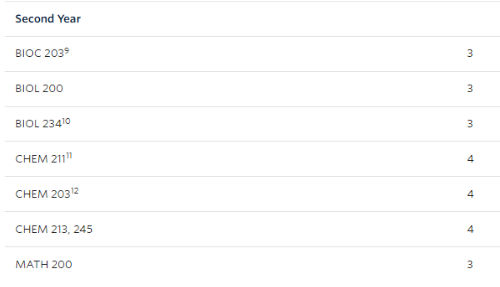
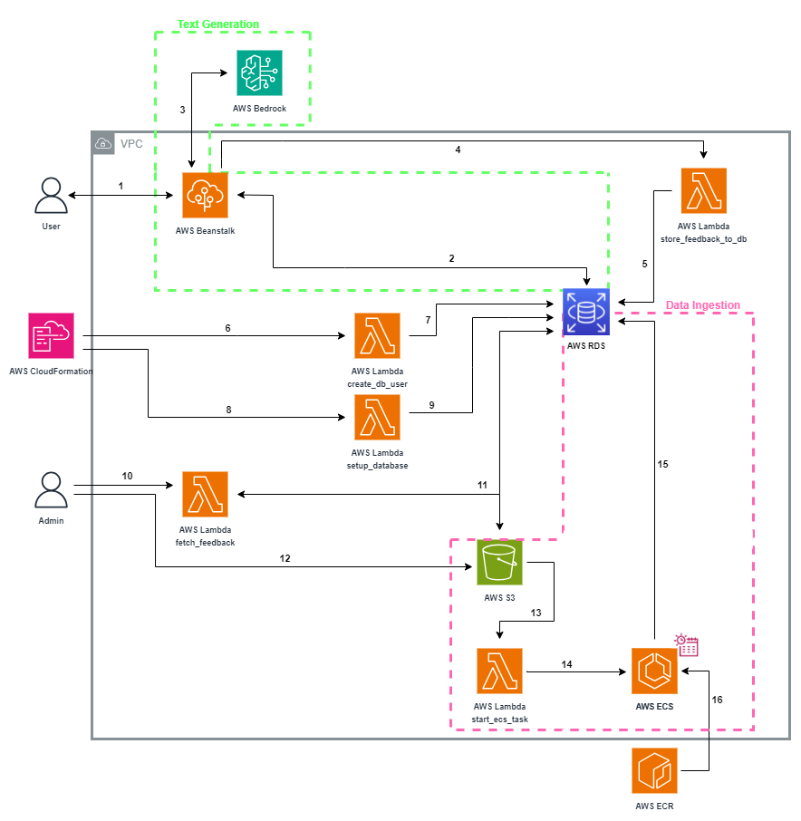
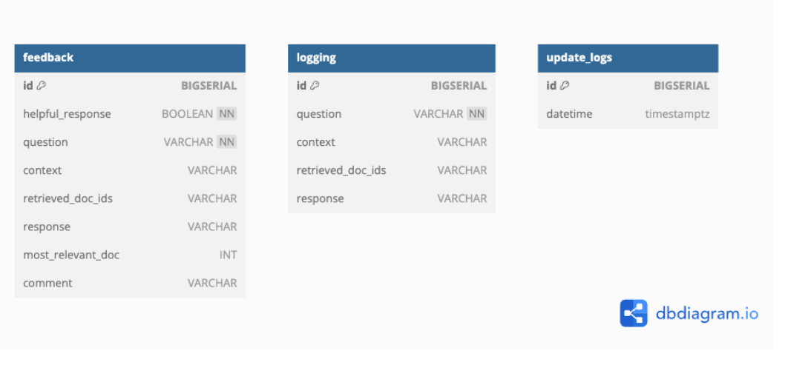

# Architecture Design

This document provides a more in-depth explanation of the system's architecture and operation.

## Table of Contents
- [Architecture Design](#architecture-design)
  - [Table of Contents](#table-of-contents)
- [Introduction](#introduction)
- [System Overview](#system-overview)
  - [Data Processing](#data-processing)
    - [Website Scraping](#website-scraping)
  - [Question Answering System](#question-answering-system)
    - [Document Retrieval](#document-retrieval)
    - [Answer Generation](#answer-generation)
- [AWS Infrastructure](#aws-infrastructure)
  - [Architecture Diagram](#architecture-diagram)
  - [Database Schema](#database-schema)

# Introduction

The student advising assistant is a system intended to help students find answers to academic and policy related questions, by referencing official university documentation and synthesizing an answer using large language models. 

At a high level, this is achieved using [Retrieval Augmented Generation](https://docs.aws.amazon.com/sagemaker/latest/dg/jumpstart-foundation-models-customize-rag.html). The system preprocesses specified information websites, and then fetches relevant sections when a user inputs a question through the web UI. Given these references, the system uses a large language model to generate an informed response to the user's question.

# System Overview

This section will introduce the main components of the system.

- The data ingestion / processing pipeline is shown by the green ‘preprocessing’ section in the diagram above, see more details in [Data Processing](#data-processing)
- The question answering system includes the ‘retrieval’ and ‘generation’ sections in the diagram above, more details in [Document Retrieval](#document-retrieval) and [Answer Generation](#answer-generation)

## Data Processing

The data ingestion / processing step scrapes the websites that the Admin specifies as information sources, then segments and preprocesses the contents for use by the question answering system. This step is performed only occasionally, when the information needs to be updated from the source websites.

### Website Scraping

The pipeline recursively downloads all child pages of the web pages specified in the configuration file. It keeps track of any redirects that occur, so that the processing step can identify link relationships between pages. It imposes a wait time between page downloads, as not to overburden the target websites.
Preprocessing

After the scraping step downloads all of the html pages from the specified websites, the preprocessing step needs to clean unnecessary elements, extract the text content, and split the text into smaller chunks. The text needs to be chunked since the embedding models and large language models require input text to be below a certain length.
Processing information for the purpose of student advising has some unique challenges, which the preprocessing step helps to address.

**Contextual information in titles**

There may be many sections of text from the included websites that appear similar when taken out of context, but actually apply to different faculties or programs. In these cases, the context is often given by the hierarchical structure of web pages, or even the hierarchical structure of titles within one webpage. For example, see below a website extract taken out of context:



The extract makes a lot more sense with the information that the titles of parent pages are “Faculties, Colleges, and Schools”, “The Faculty of Science”, “Bachelor of Science” and the hierarchical titles leading to this extract on this webpage are “Biotechnology”, “Honours Biotechnology”.

The data processing script keeps track of both types of titles and stores the information with each extract, so that the context is not lost. It identifies these titles within web pages in a configurable manner by html attributes.

**Intelligent chunking with HTML and sentence awareness**

Common text chunking techniques will convert html page contents into text, and then indiscriminately chunk the text, thereby losing valuable information that the html tags and structure provide. The data processing pipeline is aware of html tags, and splits text by section or paragraph whenever possible. When a paragraph is too long, it uses spaCy to identify sentences and split the paragraph on a sentence boundary. This improves the embedding quality, since text extracts are more likely to stick to a single topic. It also improves answer generation, since it reduces the likelihood of reference extracts being cut off and thus losing information. 

**Table understanding**

The Academic Calendar and other UBC information sources present a lot of information using non-free-text formats such as tables, which presents difficulty since LLMs are mostly trained to understand free text.

Some models are trained to answer questions over tables (models tested were TAPAS, TAPEX, and Markup LM), but these did not demonstrate satisfactory understanding of the tables common in the UBC Academic Calendar, such as degree requirements tables.

As a result, the data processing step includes some table conversion functions to convert tables into sentences for better interpretability for LLMs. It includes some custom conversions for some types of tables in the Academic Calendar, and fallback conversions for generic tables.

**Footnotes**

Additionally, many tables use footnotes, indicated by superscripts within table cells. These footnotes could contain valuable information for interpreting the table, but may be cut off from the table with normal chunking techniques. The data processing step identifies footnotes indicated by superscripts in tables, and injects the footnote text into the processed text from the table so that footnote information is not lost from the chunked extracts.

**Extract relationships**

The processing step also keeps track of the relationships between extracts. ‘Parent’ extracts are associated with their hierarchical ‘children’, and these children are ‘siblings’. Any extract that contains a link to another extract also has a relationship to the target of the link. These link relationships take redirects into account (see 4.1.2). The relationships are stored in a graph data structure. Currently, the question answering system does not leverage this information, but it could be valuable for future avenues of development that might take the relationships into account for better document retrieval.

**Embedding**

To support the question answering system’s document retrieval by semantic search (see x.x.x), the text extracts are ‘embedded’ using the all-mpnet-base-v2 model. The model converts free text into dense vectors in a high-dimensional space, where the vectors represent the topic and meaning of the text.

Since a disproportionate amount of the ‘meaning’ of an extract is expressed by its titles (as discussed in 4.1.2) as opposed to its actual content, the embedding step takes an unusual approach. For each extract, it embeds the ‘parent titles’ (the titles of parent web pages), ‘page titles’ (the titles leading up to an extract within a particular page), and the extract’s text individually, and then concatenates the resulting embeddings to create a longer vector. As a result, when the question answering system performs semantic search over these vectors, the titles have a large impact on which extracts are returned. This is very helpful in the context of student advising, where it is essential that the system returns the right extracts for a student’s faculty/program/etc. 

**Vector Store**

After computing the embeddings for each extract, the system uploads them to a vector store, which is a database designed to store vector embeddings. The system supports two choices of vector stores: RDS with pgvector (see [Document Retrieval](#document-retrieval) for more details).

RDS supports similarity search, hybrid search, and metadata filtering while being scalable. It is integrated with the AWS CDK and thus easy to deploy.

The system uploads the vector embeddings with a set of metadata such as titles, text content (un-embedded), and url.

## Question Answering System

At the front end of the question answering system, a user enters a question, and may include optional additional context (faculty, program, specialization, year level, and/or topic).

### Document Retrieval

**Semantic Search**
The system combines the user-inputted context with the question and embeds the text. The embedded text is sent to the vectorstore to perform a search for semantically similar extracts using the embedded query. The semantic search filters on metadata for faculty and/or program, if provided, so that only extracts within the user’s selected faculty and/or program will be returned. If the user includes their specialization and year level, this is included in the query used for semantic search, but the system does not strictly filter extracts on these fields.

See below for more details depending on the chosen retriever: pgvector.
___
**RDS with pgvector**

If the admin chose to use the pgvector retriever, then the embedded query is sent to the RDS DB and compared with all vectors in the DB by cosine similarity search. If the user provides their faculty and/or program, entries matching the faculty and program are more likely to be returned.
___

**LLM Filter**

The documents that the retriever returns are the most semantically similar to the user’s question, but this does not necessarily mean they will be relevant to answer the question. The system then performs a second level of filtering using the LLM, by prompting the LLM to predict whether each extract is relevant to answer the question or not. If not, it is removed from the pool. This step helps to remove irrelevant information and reduce hallucinations in the answer generation step. Depending on the LLM model used, the LLM may respond to the prompt with an explanation in addition to its yes/no answer. The system will record and display the reasoning if given.

**Context Zooming**

If the filter step removes all returned documents, then the system removes some of the provided context and redoes the semantic search, effectively ‘zooming out’ the context, in case the answer lies in a more general section of the information sources. For example, a student in a particular program may ask a question where the answer lies under the general University policies, rather than in the pages specifically for their program. By zooming out the context, the system can retrieve the relevant information.

### Answer Generation

Using the remaining filtered extracts as context, the system prompts the LLM to generate a response that answers the user’s query. The prompt is engineered to encourage the LLM to use the provided context to answer the question and no prior knowledge, but it is always possible that a generative model will hallucinate, or misinterpret the given context.

Finally, the system displays the generated answer in the web UI. Since the generated answer is more experimental, it also displays the extracts that it used as references, and links to their original webpages. 

**LLM Model Comparison**

By default, the system uses the Vicuna 7b LLM published by [lmsys](https://lmsys.org/). 
When choosing a model, the following requirements were taken into account:
- Open source and viable for commercial use
    - For public institutions such as Universities, permission for commercial use may not be required, but the commercial use clause allows more safety and flexibility
- 7B (7 billion) parameters or less, to reduce cost of running the LLM.
    - Models with larger number of parameters require more expensive cloud instances, which may cause the system to be out of budget.
    - 7B is the minimum size for most leading LLMs as of the time of writing (August 2023).

The more traditional, non-generative models based on BERT were considered first, since they are smaller than modern generative LLMs would be far more cost-effective to run. However, these models demonstrate a lack of general language and logic understanding necessary to answer complex questions. See **LLM Sample Questions** below, for some sample responses from `distilbert-base-cased-distilled-squad`, a BERT-type model that is finetuned for extractive question answering. The answers demonstrate that the model is not strong enough for this purpose.

The [Open LLM Leaderboard](https://huggingface.co/spaces/HuggingFaceH4/open_llm_leaderboard) by huggingface lists open source LLMs ranked by several metrics. At the time of writing (August 2023), the leading models of size 7B or less are:
- LLaMa-2 Variants
    - [StableBeluga-7B](https://huggingface.co/stabilityai/StableBeluga-7B), fine-tuned on an Orca-style dataset (non-commercial)
    - [Nous-Hermes-llama-2-7b](https://huggingface.co/NousResearch/Nous-Hermes-llama-2-7b), fine-tuned on an instruction-following dataset, also synthetic from GPT-4
    - [Llama2-7B-sharegpt4](https://huggingface.co/beaugogh/Llama2-7b-sharegpt4), finetuned on the ShareGPT dataset, which consists of user-shared conversations with ChatGPT
    - [Vicuna-7B](https://huggingface.co/lmsys/vicuna-7b-v1.5), also finetuned using the ShareGPT dataset
        - Other versions of Vicuna-7B are also high ranking in the leaderboard
        - v1.3 is tuned from LLaMa-1 and thus non-commercial, but v1.5 is tuned from LLaMa-2 and viable for commercial use
    - [Manatee-7B](https://huggingface.co/ashercn97/manatee-7b), finetuned on Orca datasets (non-commercial)
    - [Llama-2-7b-chat](https://huggingface.co/meta-llama/Llama-2-7b-chat-hf), plain Llama-2 chat version
    - [Airoboros-7b](https://huggingface.co/jondurbin/airoboros-l2-7b-gpt4-1.4.1), finetuned on synthetic data generated by GPT4
    - ... The list of LLaMa-2 variants continues, and is in constant development. This list is limited to those with an average score of 55 or higher
- [MPT-7B-chat](https://huggingface.co/mosaicml/mpt-7b-chat) (non-commercial)
    - This model is more difficult to deploy on SageMaker endpoints, and as such was not considered, since it could not be deployed in a 'plug and play' manner like the other models.
- [Falcon-7B Instruct](https://huggingface.co/tiiuae/falcon-7b)

With average scores of 49.95 and 47 respectively, MPT-7B and Falcon-7B fall considerably behind the LLaMa-2-7B variants which have scores up to 59. MPT is not supported out of the box for Sagemaker Inference Endoints, so it was not tested. Falcon-7B was tested, and despite prompt engineering, it had a high tendency for hallucinations.

There is also a leaderboard of models ranked by human evaluation in the [lmsys chatbot arena](https://huggingface.co/spaces/lmsys/chatbot-arena-leaderboard). Some models that perform well according to automatic metrics may not perform well when ranked by human evaluators, and vice versa. As of August 2023, the leading <= 7B model in this leaderboard is `Vicuna-7b`, though the other Llama-2 variants listed in the Open LLM leaderboard were not included in the comparison. 

According to another leaderboard, [Alpaca Eval](https://tatsu-lab.github.io/alpaca_eval/), `Vicuna-7b` is also the leading 7B model. This leaderboard uses GPT4 and Claude to automatically rank models by the quality of their responses.

**LLM Sample Questions**

See the [Model Comparison](./Model%20Comparison.xlsx) worksheet for a list of sample questions asked on different contexts. The models tested were `Vicuna-7b`, `Nous-Hermes-llama-2-7b`, and `Llama-2-7b-chat` since they are leading `7b` models with licenses allowing for commercial use. Also included was `distilbert-base-cased-distilled-squad`, a non-generative question answering model that responds to questions by extracting a portion of the provided context.

The following prompt was used for the sample questions:
```
Please answer the question based on the context below.
Use only the context provided to answer the question, and no other information.
If the context doesn't have enough information to answer, explain what information is missing.
```

The inputted context and question were provided in the format below, with {context} replaced by the context and {question} replacd by the question.
```
Context:
{context}

Question:
{question}
```

Each of the LLaMa-based models have a different expected input format. The following formats were used, with {prompt} replaced by the prompt copied above and {input} replaced by the context and question as shown in the template above.
- `Vicuna-7b`
```
USER:
{prompt}
{input}
ASSISTANT:
```
- `Nous-Hermes-llama-2-7b`
```
### Instruction:
{prompt}

### Input:
{input}

### Response:
```
- `Llama-2-7b-chat`
```
<s>[INST] <<SYS>>
{prompt}
<</SYS>>
{input}
[/INST]
```

The model testing was done with SageMaker inference endpoints, and the following parameters:
```
"parameters": {
    "do_sample": False,
    "max_new_tokens": 200,
    "temperature": 0.1
}
```

**LLM Licenses**

Note that all LLaMA-2 variants are not 100% "open" since they are subject to the [LLAMA 2 COMMUNITY LICENSE AGREEMENT](https://github.com/facebookresearch/llama/blob/main/LICENSE), which allows for commercial use, but places some restrictions such as the requirement that the model not be used for illegal purposes.

Also note that any models finetuned using outputs from OpenAI models have a somewhat ambiguous license. This includes `Llama2-7B-sharegpt4`, `Vicuna-7B`, `Airoboros-7b`, or any other models finetuned using the ShareGPT dataset or other synthetic datasets derived from OpenAI models models like ChatGPT or GPT-4. The [OpenAI Terms of Use](https://openai.com/policies/terms-of-use) states:

> (c) Restrictions. You may not [...] (iii) use output from the Services to develop models that compete with OpenAI;

As a result, there is some legal ambiguity when using these models. The student advising assistant is not intended to compete with OpenAI.

**No-LLM Mode**

There is also the option to run the system without the use of an LLM at all. This could be for safety reasons (eg. to avoid the potential inaccuracy of a generated response), or for cost reasons (the majority of the cost of provisioning the system is due to hosting the LLM model).

The Deployment Guide explains how to deploy the system in no-llm mode.

# AWS Infrastructure

This section provides an overview of the AWS components used in the system architecture.

## Architecture Diagram 



**Amazon Virtual Private Cloud (VPC)**
Various components of the infrastructure are placed inside a VPC for a more isolated and secure cloud environment.

Information related to VPC networking specifications can be separately found [here](NetworkingSpecifications.md). Please familiarize yourself with the services in the architecture first before going through the Networking document mentioned above.

**Question Answering**

1. A user (eg. a student) interacts with the web UI of the application hosted on AWS Elastic Beanstalk, and submits a query. 
2. Using semantic search over the embedded documents in the Amazon RDS PostgreSQL database, the app fetches documents that are most closely related to the user’s query.
    1. The diagram illustrates the case where documents are stored in Amazon RDS.
3. The app makes an API Request to a model hosted on Amazon Bedrock, prompting it to respond to the user’s query using the retrieved documents from step 2 as context. The app then displays the response and the reference documents to the user in the web UI.
4. The system logs all questions and answers, storing them in the Amazon RDS PostgreSQL database by making a request to an AWS Lambda Function as a proxy. Users can provide feedback to help improve the solution, which is also stored in the Amazon RDS PostgreSQL database using the AWS Lambda Function.

**Data Processing**

5. When an Admin wants to configure the underlying settings of the data processing pipeline (eg. website scraping settings), they can modify and upload a config file to the predetermined folder on an Amazon S3 Bucket.
6. The S3 Bucket triggers an invocation of an AWS Lambda Function to start a Task with the container cluster on Amazon ECS.
7. This container cluster starts a Task that first performs web scraping of the configured websites, then processes the pages into extracts, and computes the vector embedding of the extracts. Finally, it stores the embeddings in the Amazon RDS PostgreSQL database (with pgvector support enabled). The Task is also scheduled to run every 4 months by default with a CRON-expression scheduler. An Admin/Developer can modify the schedule on-demand via the ECS console.
    1. The diagram illustrates the case where documents are stored in Amazon RDS.

## Database Schema

Below is the schema for the AWS RDS PostgreSQL database.



- feedback: stores the feedback provided by users
- logging: stores inputted questions and the system-generated responses
- update_logs: record the latest date that the system updated the data (pulled from information websites)


There are other tables automatically created and maintained by the Langchain library to store and manage the document embeddings with PGVector. These are not included in the schema since they are managed by Langchain and subject to change with new Langchain versions.

