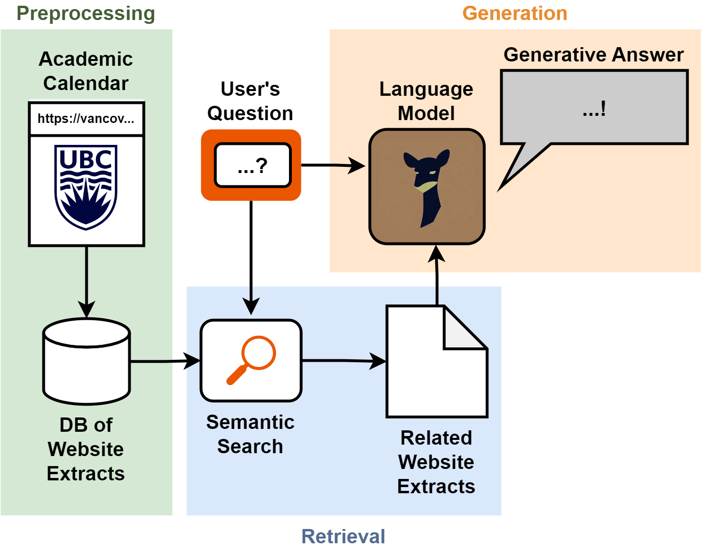

# Architecture Design

This document provides a more in-depth explanation of the system's architecture and operation.

## Table of Contents
1. [Introduction](#introduction)
2. [System Overview](#system-overview)
    i. [Data Processing](#data-processing)
    ii. [Question Answering System](#question-answering-system)
        - [Document Retrieval](#document-retrieval)
        - [Answer Generation](#answer-generation)
3. [AWS Infrastructure](#aws-infrastructure)

## Introduction

## System Overview

This section will introduce the main components of the system.

- The data ingestion / processing pipeline is shown by the green ‘preprocessing’ section in the diagram above, see more details in [Data Processing](#data-processing)
- The question answering system includes the ‘retrieval’ and ‘generation’ sections in the diagram above, more details in [Document Retrieval](#document-retrieval) and [Answer Generation](#answer-generation)

### Data Processing

The data ingestion / processing step scrapes the websites that the Admin specifies as information sources, then segments and preprocesses the contents for use by the question answering system. This step is performed only occasionally, when the information needs to be updated from the source websites.

#### Website Scraping

The pipeline recursively downloads all child pages of the web pages specified in the configuration file. It keeps track of any redirects that occur, so that the processing step can identify link relationships between pages. It imposes a wait time between page downloads, as not to overburden the target websites.
Preprocessing

After the scraping step downloads all of the html pages from the specified websites, the preprocessing step needs to clean unnecessary elements, extract the text content, and split the text into smaller chunks. The text needs to be chunked since the embedding models and large language models require input text to be below a certain length.
Processing information for the purpose of student advising has some unique challenges, which the preprocessing step helps to address.

**Contextual information in titles**

There may be many sections of text from the included websites that appear similar when taken out of context, but actually apply to different faculties or programs. In these cases, the context is often given by the hierarchical structure of web pages, or even the hierarchical structure of titles within one webpage. For example, see below a website extract taken out of context:

The extract makes a lot more sense with the information that the titles of parent pages are “Faculties, Colleges, and Schools”, “The Faculty of Science”, “Bachelor of Science” and the hierarchical titles leading to this extract on this webpage are “Biotechnology”, “Honours Biotechnology”.

The data processing script keeps track of both types of titles and stores the information with each extract, so that the context is not lost. It identifies these titles within web pages in a configurable manner by html attributes.

**Intelligent chunking with HTML and sentence awareness**

Common text chunking techniques will convert html page contents into text, and then indiscriminately chunk the text, thereby losing valuable information that the html tags and structure provide. The data processing pipeline is aware of html tags, and splits text by section or paragraph whenever possible. When a paragraph is too long, it uses spaCy to identify sentences and split the paragraph on a sentence boundary. This improves the embedding quality, since text extracts are more likely to stick to a single topic. It also improves answer generation, since it reduces the likelihood of reference extracts being cut off and thus losing information. 

**Table understanding**

The Academic Calendar and other UBC information sources present a lot of information using non-free-text formats such as tables, which presents difficulty since LLMs are mostly trained to understand free text.

Some models are trained to answer questions over tables (models tested were TAPAS, TAPEX, and Markup LM), but these did not demonstrate satisfactory understanding of the tables common in the UBC Academic Calendar, such as degree requirements tables.

As a result, the data processing step includes some table conversion functions to convert tables into sentences for better interpretability for LLMs. It includes some custom conversions for some types of tables in the Academic Calendar, and fallback conversions for generic tables.

**Footnotes**

Additionally, many tables use footnotes, indicated by superscripts within table cells. These footnotes could contain valuable information for interpreting the table, but may be cut off from the table with normal chunking techniques. The data processing step identifies footnotes indicated by superscripts in tables, and injects the footnote text into the processed text from the table so that footnote information is not lost from the chunked extracts.

**Extract relationships**

The processing step also keeps track of the relationships between extracts. ‘Parent’ extracts are associated with their hierarchical ‘children’, and these children are ‘siblings’. Any extract that contains a link to another extract also has a relationship to the target of the link. These link relationships take redirects into account (see 4.1.2). The relationships are stored in a graph data structure. Currently, the question answering system does not leverage this information, but it could be valuable for future avenues of development that might take the relationships into account for better document retrieval.

**Embedding**

To support the question answering system’s document retrieval by semantic search (see x.x.x), the text extracts are ‘embedded’ using the all-mpnet-base-v2 model. The model converts free text into dense vectors in a high-dimensional space, where the vectors represent the topic and meaning of the text.

Since a disproportionate amount of the ‘meaning’ of an extract is expressed by its titles (as discussed in 4.1.2) as opposed to its actual content, the embedding step takes an unusual approach. For each extract, it embeds the ‘parent titles’ (the titles of parent web pages), ‘page titles’ (the titles leading up to an extract within a particular page), and the extract’s text individually, and then concatenates the resulting embeddings to create a longer vector. As a result, when the question answering system performs semantic search over these vectors, the titles have a large impact on which extracts are returned. This is very helpful in the context of student advising, where it is essential that the system returns the right extracts for a student’s faculty/program/etc. 

**Vector Store**

After computing the embeddings for each extract, the system uploads them to a vector store, which is a database designed to store vector embeddings. The system supports two choices of vector stores: RDS with pgvector, or Pinecone.io (see [Document Retrieval](#document-retrieval) for more details).

Both services can perform similarity search, hybrid search, and metadata filtering. RDS is more integrated with the AWS CDK and thus easier to deploy, while Pinecone offers a free-tier hosted service which is sufficient to contain up to 50,000 extracts. Both services are scalable.

The system uploads the vector embeddings with a set of metadata such as titles, text content (un-embedded), and url.

### Question Answering System

At the front end of the question answering system, a user enters a question, and may include optional additional context (faculty, program, specialization, year level, and/or topic).

#### Document Retrieval

**Semantic Search**
The system combines the user-inputted context with the question and embeds the text. The embedded text is sent to the vectorstore to perform a search for semantically similar extracts using the embedded query. The semantic search filters on metadata for faculty and/or program, if provided, so that only extracts within the user’s selected faculty and/or program will be returned. If the user includes their specialization and year level, this is included in the query used for semantic search, but the system does not strictly filter extracts on these fields.

See below for more details depending on the chosen retriever: PGVector or Pinecone.
___
**RDS with PGVector**
If the admin chose to use the PGVector retriever, then the embedded query is sent to the RDS DB and compared with all vectors in the DB by cosine similarity search. If the user provides their faculty and/or program, only entries matching the faculty and program are returned. 
___
**Pinecone.io**
If the admin chose to use the Pinecone retriever, then the system also computes the BM25 sparse vector of the query, then sends both the sparse and dense (embedded) vectors for the query to Pinecone servers via the Pinecone API. Pinecone performs hybrid search over the vectorstore, by combining the dot product similarity scores of the sparse and dense vectors. The advantage of the hybrid search is that it takes into account both semantic similarity (dense vector) and keyword similarity (sparse vector).
___

**LLM Filter**
The documents returned by the retriever are the most semantically similar to the user’s question, but this does not necessarily mean they will be relevant to answer the question. The system then performs a second level of filtering using the LLM, by prompting the LLM to predict whether each extract is relevant to answer the question or not. If not, it is removed from the pool. This step helps to remove irrelevant information and reduce hallucinations in the answer generation step. Depending on the LLM model used, the LLM may respond to the prompt with an explanation in addition to its yes/no answer. The system will record and display the reasoning if given.

**Context Zooming**
If the filter step removes all returned documents, then the system removes some of the provided context and redoes the semantic search, effectively ‘zooming out’ the context, in case the answer lies in a more general section of the information sources. For example, a student in a particular program may ask a question where the answer lies under the general University policies, rather than in the pages specifically for their program. By zooming out the context, the system can retrieve the relevant information.

#### Answer Generation
Using the remaining filtered extracts as context, the system prompts the LLM to generate a response that answers the user’s query. The prompt is engineered to encourage the LLM to use the provided context to answer the question and no prior knowledge, but it is always possible that a generative model will hallucinate, or misinterpret the given context.

As an alternative, the system can use an ‘extractive question answering’ model, which does not create a generative answer, but rather extracts a portion of the text that answers the question. This limits the system to answering only questions where the answer exists explicitly in the text, and it cannot perform reasoning or summarization tasks. However, it removes the risk of hallucination as seen with generative models.

Finally, the system displays the generated answer in the web UI. Since the generated answer is more experimental, it also displays the extracts that it used as references, and links to their original webpages. 
