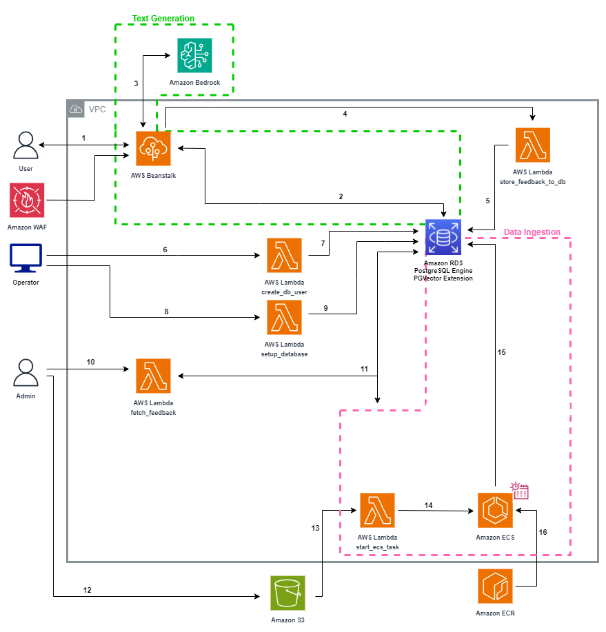
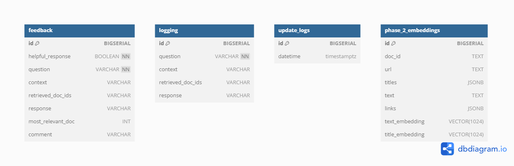

# Architecture Design

This document provides a more in-depth explanation of the system's architecture and operation.

## Table of Contents
- [Architecture Design](#architecture-design)
  - [Table of Contents](#table-of-contents)
- [Introduction](#introduction)
- [System Overview](#system-overview)
  - [Data Processing](#data-processing)
    - [Website Scraping](#website-scraping)
  - [Question Answering System](#question-answering-system)
    - [Document Retrieval](#document-retrieval)
    - [Answer Generation](#answer-generation)
- [AWS Infrastructure](#aws-infrastructure)
  - [Architecture Diagram](#architecture-diagram)
  - [Database Schema](#database-schema)

# Introduction

The student advising assistant is a system intended to help students find answers to academic and policy related questions, by referencing official university documentation and synthesizing an answer using large language models. 

At a high level, this is achieved using [Retrieval Augmented Generation](https://docs.aws.amazon.com/sagemaker/latest/dg/jumpstart-foundation-models-customize-rag.html). The system preprocesses specified information websites, and then fetches relevant sections when a user inputs a question through the web UI. Given these references, the system uses a large language model to generate an informed response to the user's question.

# System Overview

This section will introduce the main components of the system.

- The data ingestion / processing pipeline is shown by the green ‘preprocessing’ section in the diagram above, see more details in [Data Processing](#data-processing)
- The question answering system includes the ‘retrieval’ and ‘generation’ sections in the diagram above, more details in [Document Retrieval](#document-retrieval) and [Answer Generation](#answer-generation)

## Data Processing

The data ingestion / processing step scrapes the websites that the Admin specifies as information sources, then segments and preprocesses the contents for use by the question answering system. This step is performed only occasionally, when the information needs to be updated from the source websites.

### Website Scraping

The pipeline recursively downloads all child pages of the web pages specified in the configuration file. It keeps track of any redirects that occur, so that the processing step can identify link relationships between pages. It imposes a wait time between page downloads, as not to overburden the target websites.
Preprocessing

After the scraping step downloads all of the html pages from the specified websites, the preprocessing step needs to clean unnecessary elements, extract the text content, and split the text into smaller chunks. The text needs to be chunked since the embedding models and large language models require input text to be below a certain length.
Processing information for the purpose of student advising has some unique challenges, which the preprocessing step helps to address.

**Contextual information in titles**

There may be many sections of text from the included websites that appear similar when taken out of context, but actually apply to different faculties or programs. In these cases, the context is often given by the hierarchical structure of web pages, or even the hierarchical structure of titles within one webpage. For example, see below a website extract taken out of context:


The extract makes a lot more sense with the information that the titles of parent pages are “Faculties, Colleges, and Schools”, “The Faculty of Science”, “Bachelor of Science” and the hierarchical titles leading to this extract on this webpage are “Biotechnology”, “Honours Biotechnology”.

The data processing script keeps track of both types of titles and stores the information with each extract, so that the context is not lost. It identifies these titles within web pages in a configurable manner by html attributes.

**Intelligent chunking with HTML and sentence awareness**

Common text chunking techniques will convert html page contents into text, and then indiscriminately chunk the text, thereby losing valuable information that the html tags and structure provide. The data processing pipeline is aware of html tags, and splits text by section or paragraph whenever possible. When a paragraph is too long, it uses spaCy to identify sentences and split the paragraph on a sentence boundary. This improves the embedding quality, since text extracts are more likely to stick to a single topic. It also improves answer generation, since it reduces the likelihood of reference extracts being cut off and thus losing information. 

**Table understanding**

The Academic Calendar and other UBC information sources present a lot of information using non-free-text formats such as tables, which presents difficulty since LLMs are mostly trained to understand free text.

Some models are trained to answer questions over tables (models tested were TAPAS, TAPEX, and Markup LM), but these did not demonstrate satisfactory understanding of the tables common in the UBC Academic Calendar, such as degree requirements tables.

As a result, the data processing step includes some table conversion functions to convert tables into sentences for better interpretability for LLMs. It includes some custom conversions for some types of tables in the Academic Calendar, and fallback conversions for generic tables.

**Footnotes**

Additionally, many tables use footnotes, indicated by superscripts within table cells. These footnotes could contain valuable information for interpreting the table, but may be cut off from the table with normal chunking techniques. The data processing step identifies footnotes indicated by superscripts in tables, and injects the footnote text into the processed text from the table so that footnote information is not lost from the chunked extracts.

**Extract relationships**

The processing step also keeps track of the relationships between extracts. ‘Parent’ extracts are associated with their hierarchical ‘children’, and these children are ‘siblings’. Any extract that contains a link to another extract also has a relationship to the target of the link. These link relationships take redirects into account (see 4.1.2). The relationships are stored in a graph data structure. Currently, the question answering system does not leverage this information, but it could be valuable for future avenues of development that might take the relationships into account for better document retrieval.

**Embedding**

To support the question answering system’s document retrieval by semantic search (see x.x.x), the text extracts are ‘embedded’ using Amazon Titan Text Embeddings V2. The model converts free text into dense vectors in a high-dimensional space, where the vectors represent the topic and meaning of the text.

The ‘parent titles’ (the titles of parent web pages) and ‘page titles’ (the titles leading up to an extract within a particular page) are combined into one list. For example, the the 'parent titles are [A, B, C] and the 'page titles' are [C, D, E], then the combined list is [A, B, C, D, E]. This list is then converted into vectors and stored in a column called 'title_embedding.' The text containing the page's content is also converted into vectors and is stored in a different column called 'text_embedding.' With this, when the the question answering system performs semantic search, the embeddings in both these columns are considered. The titles have an equal impact on which extracts are returned along with the text. This is very helpful in the context of student advising, where it is essential that the system returns the right extracts for a student’s faculty/program/etc. 

**Vector Store**

After computing the embeddings for each extract, the system uploads them to a vector store, which is a database designed to store vector embeddings. The system supports the RDS with pgvector vector store (see [Document Retrieval](#document-retrieval) for more details).

RDS supports similarity search, hybrid search, and metadata filtering while being scalable. It is integrated with the AWS CDK and thus easy to deploy.

We create a custom embeddings table with the following columns:
- doc_id: the ID of the document stored in this row
- url: the URL where this document was found
- titles: the combined list of 'parent titles' and 'page titles'
- text: the content found in this document
- links: the relevant links mentioned in the document
- text_embedding: vectors representing the text found in the document
- title_embedding: vectors representing the combined titles of the document

When semantic search is conducted, with this design of the embeddings table, we can get the document details corresponding to the vectors in constant time.

Rather than scanning through each embedding in the table to find the closest match, the project uses a method called indexing, which organizes the data prior to the search. We use Hierarchical Navigable Small Worlds (HNSW) indexing, although this method can be swapped out for another even after deployment. HNSW indexing places embeddings or vertices on a proximity graph, where similar vertices are linked together, forming a connected graph.

A distance strategy refers to the method used to measure and compare the similarity between embeddings. The project uses Euclidean Distance, which measures the straight-line distance between two vectors in a vector space. The measurement ranges from 0 to infinity, where 0 represents identical vectors, and larger values represent increasingly dissimilar vectors. We employ Euclidean distance as the distance strategy in conjunction with HNSW. Before performing semantic search, it calculates the Euclidean distance between vertices, linking those with values closer to 0 to create the proximity graph.

We leverage indexing and distance measures in a flexible manner that allows both techniques to be changed without modifying the underlying code. We utilize PGVector, an extension for PostgreSQL that provides vector data types and functions for semantic searches. This extension enables the storage and querying of high-dimensional vectors, which are essential for machine learning and AI applications. Specifically, it uses ‘hnsw’ for HNSW indexing and ‘vector_l2_ops’ for the Euclidean distance measure.

By simply swapping these methods with other supported options in PGVector, the indexing and distance measurement strategies for the embeddings table can be easily altered. This setup ensures that stronger or more efficient methods can be adopted as they are developed in the future, requiring only a change in the method names. This flexibility enhances the robustness and future-proofing of the system, allowing it to stay current with the latest advancements in semantic search techniques.

By pairing HNSW indexing with the Euclidean distance strategy, we organize the embeddings table prior to the semantic search, thereby reducing the latency in finding similar documents.

## Question Answering System

At the front end of the question answering system, a user enters a question, and may include optional additional context (faculty, program, specialization, year level, and/or topic).

### Document Retrieval

**Semantic Search**
The system combines the user-inputted context with the question and embeds the text. The embedded text is sent to the vectorstore to perform a search for semantically similar extracts using the embedded query. The embedded text is put into a custom retriever that uses the K-Nearest Neighbor (KNN) algorithm, which finds the k most similar documents to a given query based on a specified distance measure. In our case, the Euclidean Distance measure is used. The HNSW indexing paired with the Euclidean distance measure ensures that the embeddings table is organized with closely related documents linked together. Combining KNN with HNSW indexing significantly speeds up document retrieval.

Semantic search is conducted over both the 'text_embedding' and 'title_embedding' columns to find documents relevant to the embedded text.The documents are then combined and prepared to be sent to the model for generating an answer.

### Answer Generation

Using the documents collected, the system prompts the LLM to generate a response that answers the user’s query. The prompt is engineered to encourage the LLM to use the provided context to answer the question.

Finally, the system displays the generated answer in the web UI. Since the generated answer is more experimental, it also displays the extracts that it used as references, the links to their original webpages, and a short text checking if the reference relates to the user's question or not.

**LLM Model Comparison**

By default, the system uses the Llama 3 8B Intruct LLM published by [Meta](https://www.meta.ai/). 
When choosing a model, the following requirements were taken into account:
- Open source and viable for commercial use
    - For public institutions such as Universities, permission for commercial use may not be required, but the commercial use clause allows more safety and flexibility
- Available on Amazon Bedrock
    - The project uses Amazon Bedrock since it is serverless and models can be easily changed.

Here is a list of models tested in Phase 2:
- Llama 3 8B Instruct
- Llama 3 70B Instruct
- Mistral 7B Instruct
- Mistral Large

**LLM Sample Questions**

See the [Model Comparison](./Model%20Comparison.xlsx) worksheet for a list of sample questions asked to each model. The models tested were `Llama 3 8B Instruct`, `Llama 3 70B Instruct`, `Mistral 7B Instruct`, and `Mistral Large` since they match the criteria of being available on Amazon Bedrock and are open source.

When generating the main answer, the `Llama 3 8B Instruct` and `Llama 3 70B Instruct` have the following prompt template:
```
prompt = f"""
          <|begin_of_text|>
          <|start_header_id|>system<|end_header_id|>
          {system_prompt}
          <|eot_id|>
          <|start_header_id|>user<|end_header_id|>
          {user_prompt}
          <|eot_id|>
          <|start_header_id|>documents<|end_header_id|>
          {documents}
          <|eot_id|>
          <|start_header_id|>assistant<|end_header_id|>
          """
```

The `Mistral 7B Instruct` and `Mistral Large` models have the following prompt template:
```
prompt = f"""{system_prompt}.
            Here is the question: {user_prompt}.
            Here are the source documents: {documents}
            """
```

The ```system_prompt``` is specified as ```"Provide a short explaination if the document is relevant to the question or not."``` and can be changed in ```application.py``` in the ```flask_app``` of the project.

The ```user_prompt``` corresponds to the user's question and ```documents```refers to the documents fetched from the retrieval process.

**LLM Licenses**

[Meta Llama 3 Community License Agreement](https://llama.meta.com/llama3/license/)

[Mistral Legal terms and conditions](https://mistral.ai/terms/)

Note that all LLaMA-2 variants are not 100% "open" since they are subject to the [LLAMA 2 COMMUNITY LICENSE AGREEMENT](https://github.com/facebookresearch/llama/blob/main/LICENSE), which allows for commercial use, but places some restrictions such as the requirement that the model not be used for illegal purposes.

Also note that any models finetuned using outputs from OpenAI models have a somewhat ambiguous license. This includes `Llama2-7B-sharegpt4`, `Vicuna-7B`, `Airoboros-7b`, or any other models finetuned using the ShareGPT dataset or other synthetic datasets derived from OpenAI models models like ChatGPT or GPT-4. The [OpenAI Terms of Use](https://openai.com/policies/terms-of-use) states:

> (c) Restrictions. You may not [...] (iii) use output from the Services to develop models that compete with OpenAI;

As a result, there is some legal ambiguity when using these models. The student advising assistant is not intended to compete with OpenAI.

**No-LLM Mode**

There is also the option to run the system without the use of an LLM at all. This could be for safety reasons (eg. to avoid the potential inaccuracy of a generated response), or for cost reasons (the majority of the cost of provisioning the system is due to hosting the LLM model).

The Deployment Guide explains how to deploy the system in no-llm mode.

# AWS Infrastructure

This section provides an overview of the AWS components used in the system architecture.

## Architecture Diagram 



**Amazon Virtual Private Cloud (VPC)**
Various components of the infrastructure are placed inside a VPC for a more isolated and secure cloud environment.

Information related to VPC networking specifications can be separately found [here](NetworkingSpecifications.md). Please familiarize yourself with the services in the architecture first before going through the Networking document mentioned above.

**Text Generation**

1. A user (eg. a student) interacts with the web UI of the application hosted on Amazon Elastic Beanstalk, and submits a query. The response collected from the model will be displayed back to the user.

2. Using semantic search over the embedded documents in the Amazon RDS PostgreSQL database, the app fetches documents that are most closely related to the user’s query.

3. The app makes an API Request to a model hosted on Amazon Bedrock, prompting it to respond to the user’s query using the retrieved documents from Step 2 as context. The app then displays the response and the reference documents to the user in the web UI.

4. The system logs all questions and answers, storing them in the Amazon RDS PostgreSQL database by making a request to an Amazon Lambda Function as a proxy. Users can provide feedback to help improve the solution, which is also stored in the Amazon RDS PostgreSQL database using the Amazon Lambda Function.

5. Logs and feedback are stored in the Amazon RDS PostgreSQL database in their respective tables.

**Lambda Functions**

6. A request to an Amazon Lambda Function is made during the Inference Stack to create a user in the database with less privileges. This user’s credentials will be used in Step 2 to retrieve documents from the Amazon RDS PostgreSQL database. This user will only be allowed to create, update, and delete data without administrator powers for security purposes.

7. The Lambda function obtains the secret from Amazon Secret Manger for credentials created in the Database Stack. It then creates the user with less privileges.

8. A request to an Amazon Lambda Function is made during the Inference Stack to create the feedback, logging, and update logs tables if they do not already exist.

9. The Lambda function obtains the secret from Amazon Secret Manger for credentials created in the Database Stack. It then creates the feedback, logging, and update logs tables.

**Data Ingestion**

10. An Administrator can navigate to Amazon Lambda using the Amazon Console. Here, the <project-name>-fetch_feedback-logs Lambda function should reside. The Administrator can then run the function by clicking on the Test tab and then clicking the Test button.

11. The Lambda function retrieves the logs and feedback data from the Amazon RDS PostgreSQL database, formats the data into readable CSV files, and stores the formatted data into an S3 Bucket created during the Inference Stack under the documents folder.

12. When an Admin wants to configure the underlying settings of the data processing pipeline (eg. website scraping settings), they can modify and upload a config file named “dump_config.json5”  to the document_scraping folder in the Amazon S3 Bucket created during the Inference Stack.

13. The S3 Bucket triggers an Amazon Lambda Function to start tasks with the container cluster on Amazon ECS.

14. This Lambda function triggers an ECS Task within a container cluster that performs the following operations:
- Web Scraping: Scrapes configured websites for data.
- Data Processing: Processes the scraped web pages into extracts.
- Vector Embedding: Computes vector embeddings for the extracted data.
- Storage: Stores the embeddings in an Amazon RDS PostgreSQL database with PGVector support enabled.
The task is scheduled to run every 4 months using a CRON-expression scheduler. The schedule can be modified on-demand by an Admin/Developer via the ECS console.

15. The Embedding Task on Amazon Elastic Container Service populates the Amazon RDS PostgreSQL database with vector embeddings.

16. Amazon Elastic Container Registry (ECR) provides a secure, scalable, and reliable way to store, manage, and deploy Docker container images. By integrating ECR with Amazon Elastic Container Service (ECS), we ensure that the latest versions of our container images are always available for deployment. This connection allows ECS to automatically pull the required container images from ECR whenever a task or service is launched, ensuring seamless updates and efficient management of containerized applications.

## Database Schema

Below is the schema for the AWS RDS PostgreSQL database.



- feedback: Stores the feedback provided by users. Specifically, stores if the response was helpful or not, the user’s inputted question, the generated response, the documents IDs that refer to the documents that helped create the response, the most relevant document, abd the user’s comment.
- logging: Stores the user’s inputted questions, the generated responses, the context of the question (faculty, program, specialization, and year if provided), and documents IDs that refer to the documents that helped create the response.
- update_logs: Records the latest date that the system updated the data pulled from the websites provided.
- phase_2_embeddings: This is the embeddings table of the project. The data under the “text_embeddings” column are vectors created from the data under the “text” column extracted from the scraped websites. The data under the “title_embeddings” column are vectors created from the data under the “parent_titles” and “titles” column extracted from the scraped websites.