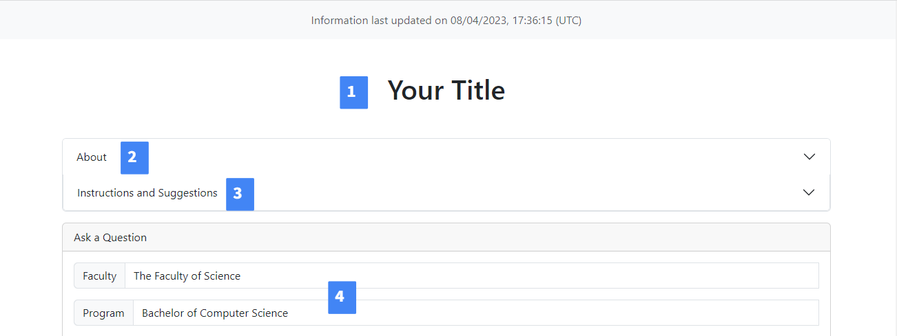
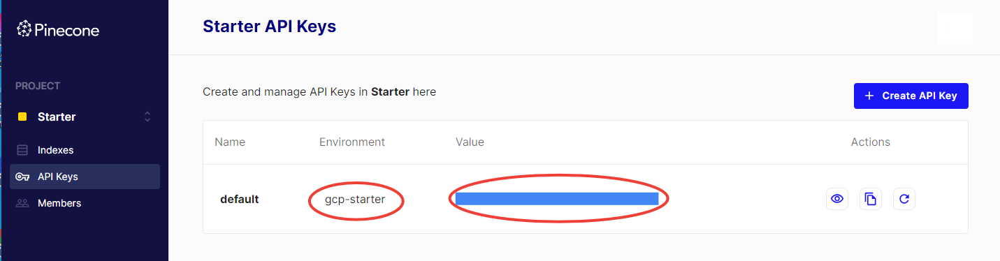
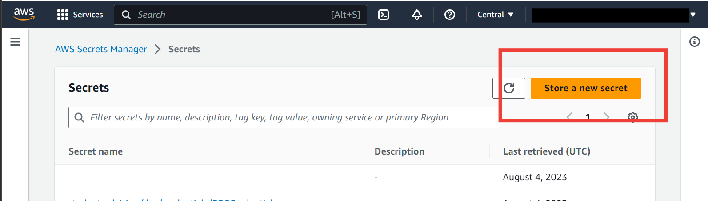
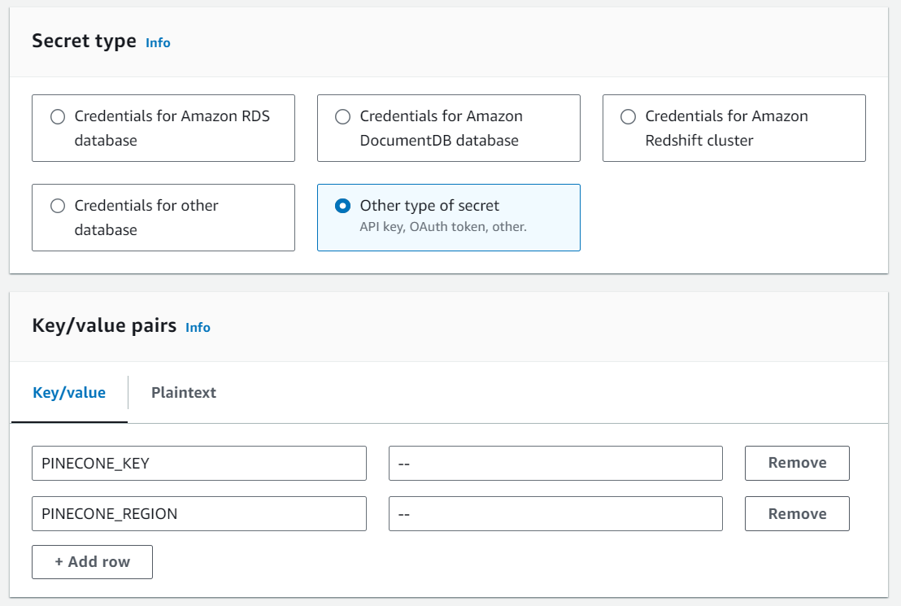
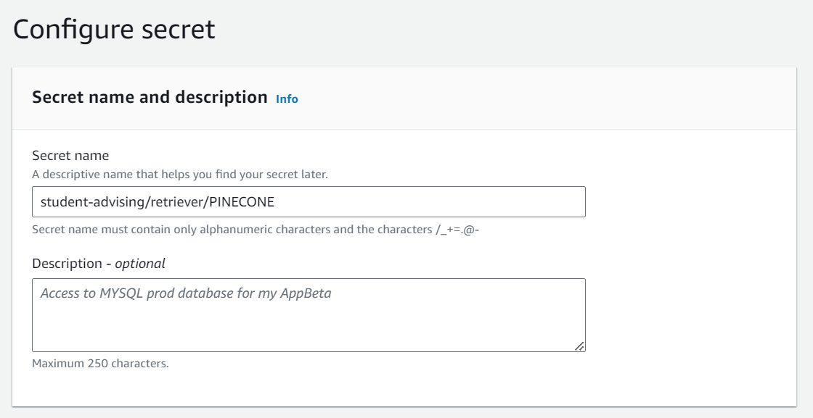

## Before Deployment 

### Customize Static Website Content


Before deployment, customize the static content of the website.
The files under `/flask_app/static` are customizable:
1. `app_title.txt`: Defines the app title to be displayed on the web app
2. `about.md`: Markdown content is displayed in the 'About' dropdown on the web app homepage
3. `query_suggestions.md`: Markdown content is displayed in the 'Instructions and Suggestions' dropdown on the web app homepage
4. `defaults.json`: Specifies the defaults for the question form - if desired, the faculty and program fields can be autopopulated with a particular value. File has the following format:
```
{
    "faculty": "<enter the default value>",
    "program": "<enter the default value>
}
```
5. `backup_response.md`: Markdown content is displayed if the system finds no response for the question, or if the user indicates that the response was not helpful. Should contain links to other advising resources.
6. `data_source_annotations`: Contains annotations to offer for each of the data sources. When a reference is taken from a website, the corresponding annotation will be displayed with it.
- File format:
```
{
    "<enter root website url>": {
        "name": "<enter display name for the website>",
        "annotation": "<enter the annotation for the website>"
    },
    ... 
    <insert as many entries as needed>
}
```
- The root url should be a section of the url that is present for all pages in the intended data source, eg "university.website.ca"
- Different subsections of the same site could have different annotations by specifying a subdirectory in the root url, eg "university.website.ca/undergrad" and "university.website.ca/graduate"
- The website urls should align with the websites chosen for download, see [User Guide](UserGuide#data-pipeline) for more details

### Setup Pinecone Index (Optional)
This step is only necessary if you choose to use the Pinecone retriever instead of PGVector.
    1. Sign up for a [Pinecone.io](https://www.pinecone.io/) account
    2. From the Pinecone console, click 'API Keys', and either create a new key or take note of the environment and value of the 'default' key
    
    3. In AWS Console navigate to Secret Manager, ensure the region is set to the same region where you will deploy the CDK, and create a new secret 
    4. Fill in the fields for the Pinecone secret
    
        - Select secret type: 'Other type of secret'
        - Enter the Key/Value pairs:
            - Key: PINECONE_KEY, Value: Insert the value of the API key from step 2
            - Key: PINECONE_REGION, Value: Insert the environment of the API key from step 2
    5. Click 'next', then enter secret name = "student-advising/retriever/PINECONE"
     
    6. Click 'next' twice more, then 'store'

## Deployment
``` insert cdk stuff here ```
x. If using Pinecone retriever, include the parameter: `--parameters InferenceStack:retriever=pinecone`