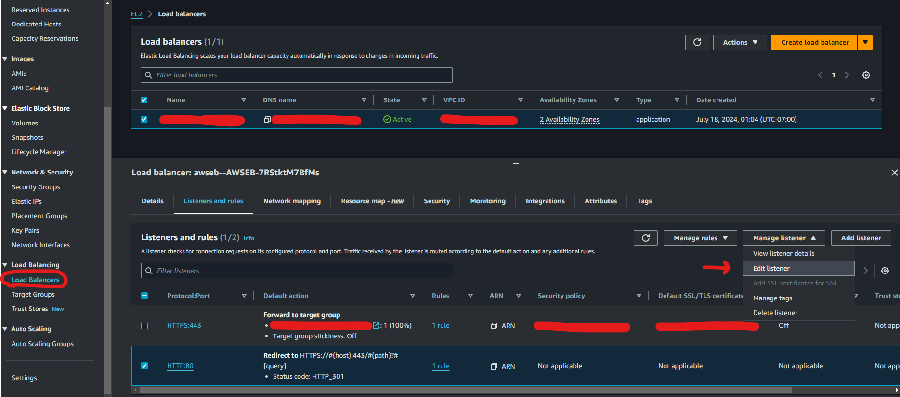

# Deployment walkthrough

## Table of Contents
- [Deployment walkthrough](#deployment-walkthrough)
  - [Table of Contents](#table-of-contents)
  - [Requirements](#requirements)
  - [Pre-Deployment](#pre-deployment)
    - [Customize Static Website Content](#customize-static-website-content)    
  - [Deployment](#deployment)
    - [Step 1: Clone The Repository](#step-1-clone-the-repository)
    - [Step 2: CDK Deployment](#step-2-cdk-deployment)
      - [**Extra: Taking down the deployed stacks**](#extra-taking-down-the-deployed-stacks)
    - [Step 3: Uploading the configuration file](#step-3-uploading-the-configuration-file)
  - [HTTPS URL](#https-url)
  - [Potential Issues](#potential-issues)

## Requirements

Before you deploy, you must have the following installed on your device:

- [git](https://git-scm.com/downloads)
- [git lfs](https://git-lfs.com/)
- [AWS Account](https://aws.amazon.com/account/)
- [GitHub Account](https://github.com/)
- [AWS CLI](https://aws.amazon.com/cli/)
- [AWS CDK](https://docs.aws.amazon.com/cdk/latest/guide/cli.html)
- [Docker Desktop](https://docs.docker.com/desktop/) (make sure to install the correct version for you machine's operating system).
- [npm](https://docs.npmjs.com/downloading-and-installing-node-js-and-npm)*

If you are on a Windows device, it is recommended to install the [Windows Subsystem For Linux](https://docs.microsoft.com/en-us/windows/wsl/install)(WSL), which lets you run a Linux terminal on your Windows computer natively. Some of the steps will require its use. [Windows Terminal](https://apps.microsoft.com/store/detail/windows-terminal/9N0DX20HK701) is also recommended for using WSL.

*It is recommended to use a npm version manager rather than installing npm directly. For Linux, install npm using [nvm](https://github.com/nvm-sh/nvm). For Windows, it is recommended to use WSL to install nvm. Alternatively, Windows versions such as [nvm-windows](https://github.com/coreybutler/nvm-windows) exist.

## Pre-Deployment

### Customize Static Website Content


Before deployment, customize the static content of the website.
The files under `/flask_app/static` are customizable:
1. `app_title.txt`: Defines the app title to be displayed on the web app
2. `about.md`: Markdown content is displayed in the 'About' dropdown on the web app homepage
3. `query_suggestions.md`: Markdown content is displayed in the 'Instructions and Suggestions' dropdown on the web app homepage
4. `defaults.json`: Specifies the defaults for the question form - if desired, the faculty and program fields can be autopopulated with a particular value. File has the following format:
```
{
    "faculty": "<enter the default value>",
    "program": "<enter the default value>
}
```
5. `backup_response.md`: Markdown content is displayed if the system finds no response for the question, or if the user indicates that the response was not helpful. Should contain links to other advising resources.
6. `data_source_annotations`: Contains annotations to offer for each of the data sources. When a reference is taken from a website, the corresponding annotation will be displayed with it.
- File format:
```
{
    "<enter root website url>": {
        "name": "<enter display name for the website>",
        "annotation": "<enter the annotation for the website>"
    },
    ... 
    <insert as many entries as needed>
}
```
- The root url should be a section of the url that is present for all pages in the intended data source, eg "university.website.ca"
- Different subsections of the same site could have different annotations by specifying a subdirectory in the root url, eg "university.website.ca/undergrad" and "university.website.ca/graduate"
- The website urls should align with the websites chosen for download, see [User Guide](UserGuide#data-pipeline) for more details
7. `defaults.json`: Specifies the default faculty and program to autofill the dropdown menu of the UI with. If the system is to be used for a particular faculty's advising, then specify these defaults.
- File format:
```
{
    "faculty": "<enter default faculty name>",
    "program": "<enter default program name>"
}
```

## Deployment 

### Step 1: Clone The Repository

First, clone the GitHub repository onto your machine. To do this:

1. Create a folder on your computer to contain the project code.
2. For an Apple computer, open Terminal. If on a Windows machine, open Command Prompt or Windows Terminal. Enter into the folder you made using the command `cd path/to/folder`. To find the path to a folder on a Mac, right click on the folder and press `Get Info`, then select the whole text found under `Where:` and copy with ⌘C. On Windows (not WSL), enter into the folder on File Explorer and click on the path box (located to the left of the search bar), then copy the whole text that shows up.
3. Clone the github repository by entering the following:

```bash
git clone https://github.com/UBC-CIC/student-advising-assistant
```

The code should now be in the folder you created. Navigate into the root folder containing the entire codebase by running the command:

```bash
cd student-advising-assistant
``` 

### Step 2: CDK Deployment

It's time to set up everything that goes on behind the scenes! For more information on how the backend works, feel free to refer to the Architecture Deep Dive, but an understanding of the backend is not necessary for deployment.

**IMPORTANT**: Before moving forward with the deployment, please make sure that your **Docker Desktop** software is running (and the Docker Daemon is running). Also ensure that you have npm installed on your system.

Note this CDK deployment was tested in `us-west-2` region only.

Open a terminal in the `/backend/cdk` directory.
The file `demo-app.zip` should already exist in the directory. In the case that it does not, navigate back to the root directory `student-advising-assitant/` and run the following command to create it:
``` bash
zip -r demo-app.zip aws_helpers/ flask_app/ Dockerfile -x "*/.*" -x ".*" -x "*.env" -x "__pycache__*"
```
Note: `zip` command requires that you use Linux or WSL. If `zip` is not installed, run `sudo apt install zip` first.

**Download Requirements**
Install requirements with npm:
```npm install```

**Configure the CDK deployment**
The configuration options are in the `/backend/cdk/config.json` file. By default, the contents are:
```
{
    "retriever_type": "pgvector",
    "llm_mode": "bedrock"
}
```
- `retriever_type` allowed values: "pgvector"
- `llm_mode` allowed values: "bedrock", "ec2", "sagemaker", "none"

If you would not like to to use `"bedrock"` as the `llm_mode` and use any of the other options, you must do the following:
- Go to `wsgi.py` in the `flask_app` folder and change ```from application import application``` to ```from old_application import application```

If you would prefer not to deploy the LLM, set the `llm_mode` to `"none"`. The system will not deploy a LLM endpoint, and it will return references from the information sources only, without generated responses. 

The `"sagemaker"` options for `llm_mode` will host the model with an SageMaker inference endpoint instead of an EC2 instance. This may incur a higher cost.

**Initialize the CDK stacks**
(required only if you have not deployed any resources with CDK in this region before)

```bash
cdk synth --profile your-profile-name
cdk bootstrap aws://YOUR_AWS_ACCOUNT_ID/YOUR_ACCOUNT_REGION --profile your-profile-name
```

**Deploy the CDK stacks**

You may  run the following command to deploy the stacks all at once. Please replace `<profile-name>` with the appropriate AWS profile used earlier. 

```bash
cdk deploy --all --profile <profile-name>
```

#### **Extra: Taking down the deployed stacks**

To take down the deployed stack for a fresh redeployment in the future, navigate to AWS Cloudformation, click on the stack(s) and hit Delete. Please wait for the stacks in each step to be properly deleted before deleting the stack downstream. The deletion order is as followed:

1. HostingStack
2. InferenceStack
3. student-advising-DatabaseStack
4. student-advising-VpcStack

### Step 3: Uploading the configuration file

To complete the deployment, you will need to upload a configuration file specifying the websites to scrape for information. Continue with the [User Guide](./UserGuide.md#updating-the-configuration-file) for this step.

## HTTPS URL
#### **We are using Let's Encrypt to create SSL certificate**
1. Use Session Manager to connect to ```student-advising-demo-app-env``` EC2 Instance
2. Once connected, run ```sudo amazon-linux-extras install epel```. This is used on Amazon Linux systems to install the Extra Packages for Enterprise Linux (EPEL) repository
3. Install Certbot with ```sudo yum install certbot```. Certbot is a tool that automates the process of obtaining and renewing Let's Encrypt certificates
4. Since we need port 80 to be available, check for open files and network connections using ```sudo lsof -i :80```
5. If you see something running on port 80, for example nginx, run ```sudo systemctl stop nginx``` to stop the process for now
6. Run ```sudo certbot certonly --standalone --preferred-challenges http -d student-advising-demo.us-west-2.elasticbeanstalk.com,www.student-advising-demo.us-west-2.elasticbeanstalk.com```. This will helps obtain an SSL certificate for the domain(s) we have specified using Certbot. Answer the prompts the program asks after running the command
7. To restart the processes stopped in Step 5, for example if nginx was stopped, run ```sudo systemctl start nginx```
8. When the process in Step 6 completes successfully, you should get a message like this:
IMPORTANT NOTES:
 - Congratulations! Your certificate and chain have been saved at:
   /etc/letsencrypt/live/student-advising-demo.us-west-2.elasticbeanstalk.com/fullchain.pem
   Your key file has been saved at:
   /etc/letsencrypt/live/student-advising-demo.us-west-2.elasticbeanstalk.com/privkey.pem
   Your certificate will expire on 2024-10-10. To obtain a new or
   tweaked version of this certificate in the future, simply run
   certbot again. To non-interactively renew *all* of your
   certificates, run "certbot renew"

These mention where the certificates are saved. To copy the certificates into a preferred location, run the following commands:
```bash
sudo cp /etc/letsencrypt/live/student-advising-demo.us-west-2.elasticbeanstalk.com/fullchain.pem /path/to/your/location/
sudo cp /etc/letsencrypt/live/student-advising-demo.us-west-2.elasticbeanstalk.com/privkey.pem /path/to/your/location/
```
9. You can now go to the preferred location where the certificates are saved with ```cd /path/to/your/location/``` and print the contents within each certificate with ```cat fullchain.pem``` and ```cat privkey.pem```
10. Go to AWS Certificate Manager using the AWS Console. Then click on "Import" in the top right corner. Then you should see the screen below:

11. Copy the first block within ```fullchain.pem``` into "Certificate body." Copy the second block within ```fullchain.pem``` into "Certificate chain" which is optional. Copy the private key within ```privkey.pem``` into "Certificate private key." Click on "Import Certificate" to complete this process and you should see the new certificate listed in Certificate Manager.
12. Go to the ```student-advising-demo-app-env``` Elastic Beanstalk environment through the AWS Console. Click on "Configuration". Then edit the "Instance traffic and scaling" settings

13. After clicking on the "Edit" button, scroll down to "Listeners" and a listener with the following configuration:
	- Listener port: 443
	- Listener protocal: HTTPS
	- SSL certificate: select the one created in Step 11
You should then see the new listener like this:

14. Click on "Apply" at the bottom and wait for the environment to update
15. You should now be able to go to an HTTPS URL. To redirect HTTP protocols to HTTPS, go to AWS EC2 through the AWS Console. Click on "Load Balancers" and then click the load balancer for the project. Go to the "Listeners and rules" tab. There you should see 2 listerns and rules. Select the HTTP listener and click on "Edit listener"

16. In the screenshot above, the HTTP Listener already redirects to HTTPS. To make it redirect to HTTPS, after clicking "Edit listener," select the "Redirect to URL" Routing action and select HTTPS Protocol with Port 443. Then click "Save changes." HTTP should now redirect to HTTPS.


## Potential Issues

#### **Update aws-cdk-lib and Postgres Engine Version in database-stack.ts**
Go to backend/cdk/package.json to updated "aws-cdk-lib" version. Then, go to backend/cdk/lib/database-stack.ts. There you can change the Postgres Engine Version. For example, you can change ```version: rds.PostgresEngineVersion.VER_15_2``` to ```version: rds.PostgresEngineVersion.VER_16```

#### **Update Beanstalk Platform/Solution Stack Name in hosting-stack.ts**
Go to https://docs.aws.amazon.com/elasticbeanstalk/latest/platforms/platform-history-docker.html and find the latest platform that runs Docker (has "running Docker" in the end of the name). Update Solution Stack Name in backend/cdk/hosting-stack.ts. For example, you can change ```solutionStackName: "64bit Amazon Linux 2 v3.6.0 running Docker"``` to ```solutionStackName: "64bit Amazon Linux 2 v3.8.1 running Docker"```

#### **Requesting more vCPU capacity than your current limit**
If you face this issue when trying to delpy the Inference Stack, then you need to submit a Service 
quota request. Go to Service Quotas through the AWS Console. Click on AWS service on the menu on the left of the screen. Select Amazon Elastic Compute Cloud (Amazon EC2). Search and select "Running Dedicated g5 Hosts" and then click on Request increase at account level. Fill in the appropriate blanks and under New quota value, enter 8 (this was 14 in the script before I took it on, I requested 14 but they gave me 8, the script is already edited to use 8). Type a proper Use case description mentioning where you work and why you need it. They respond within a couple of hours.
