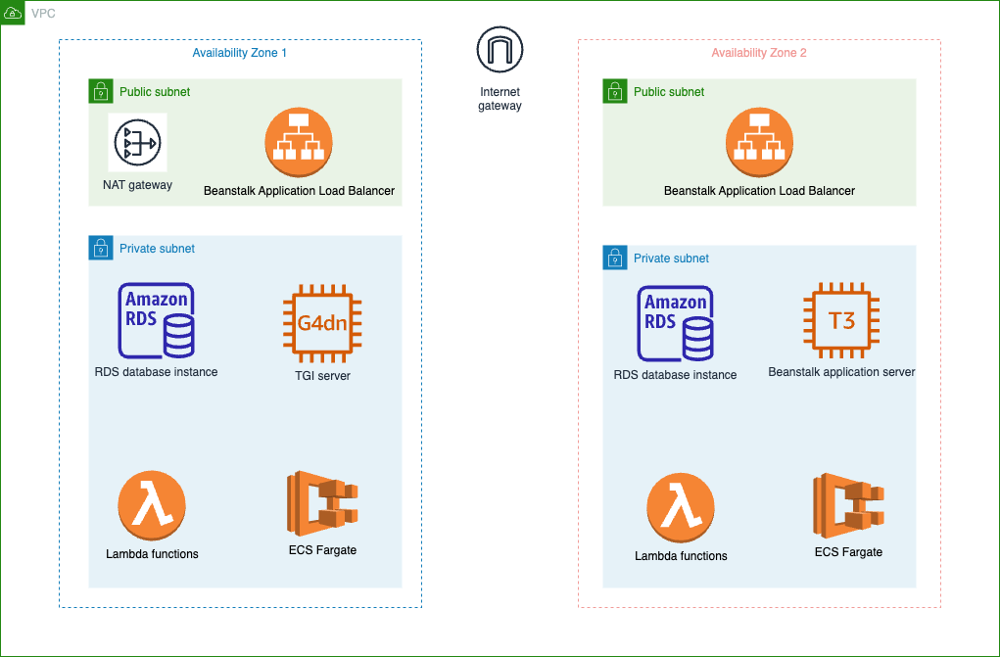

# AWS VPC Networking Specifications

## This document explains the VPC networking information for this project

### Table of Contents:

1. [Networking Schema](#1-networking-schema)
2. [Other Info](#2-other-info)

### 1. Networking Schema

### 2. Other info:

**Note**: [AWS CDK](https://docs.aws.amazon.com/cdk/v2/guide/home.html) is the official Infrastructure-as-Code toolchain by AWS that provision cloud resources with CloudFormation behind the scene. When we say "provisioned by AWS CDK", it means that the creation of the resources and their specifications is handled by CDK behind the scene according to CDK's default best practice criteria/workflows.

+ 1 VPC with 2 Availability Zones, each availability zone consist of 1 public and 1 private subnet (total of 2 public and 2 private subnets for the entire VPC)
+ VPC CIDR range is `10.0.0.0/16`
+ 1 Nat Gateway in one of the public subnets. The public subnet is chosen automatically by AWS CDK. The Elastic IP (Public EIP) of the Nat Gateway is a static public IPv4 address, provisioned automatically by AWS CDK.
+ 1 Internet Gateway.
+ Security groups:
  + AWS Lambda's security groups are provisioned by AWS CDK, no explicit inbound rule
  + RDS database instance's security group have inbound rule on port `5432` (PostgreSQL) from sources within the private subnets.
  + Elastic Beanstalk application server and application load balancer's security group is provisioned by AWS CDK.

+ Database/ec2 instances are **not publicly accessible**, and they are provisioned in the private subnets.
+ An Application Load Balancer for the Beanstalk Environment is created in the public subnets
