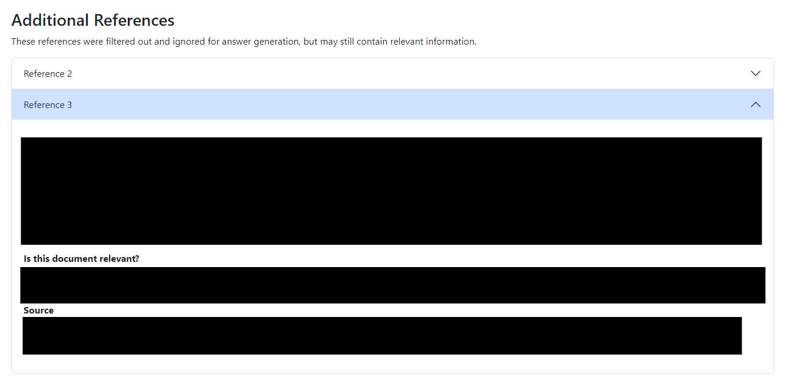

# User Guide

**Before Continuing with this User Guide, please make sure you have deployed the stacks.**

- [Deployment Guides](./DeploymentGuide.md)

Once you have deployed the solution, the following user guide will help you navigate the functions available.

| Index                                                                               | Description                                           |
| :---------------------------------------------------------------------------------  | :---------------------------------------------------- |
| [Web User Interface](#web-user-interface)    | A walkthrough of the User Interface  |
| [Data Pipeline](#data-pipeline)                                                     | Rerun the pipeline to update information sources      |
| [Pruning the Faculties and Programs List](#pruning-the-faculties-and-programs-list) | Clean the list of faculties and programs              |

## Web User Interface

**Question Screen**

The question screen is the main page of the web UI:


On the top banner, the user can see the timestamp of **when the documents were last scraped from the websites** and updated inside the database.
**Note:** This date is not the same as when the websites themselves are updated by your institution.

The 'About' and 'Instructions and Suggestions' dropdowns provide guidance to a user on how to use the system. You can specify the contents of these dropdowns by modifying the static content files - see [DeploymentGuide.md](./DeploymentGuide.md#customize-static-website-content).

Under the `Ask a Question` section, the user can specify their Faculty, Program, Specialization, and Year level so that the retrieved documents and generated answer are more relevant. Note that providing *too* much information can actually be detrimental - for example if the user wants to know about a university-wide policy, providing their specialization can cause the system to search the wrong documents. Instructions like this should be specified in the 'Instructions and Suggestions' dropdown.

To ask a question, simply type the question in the box and click `Submit`.

**Answer Screen**

After submitting, the system takes some time to load an answer, and then the user is taken to the answer screen. The answer screen will look something like this (this screenshot has the text contents removed):


Users will first see the answer generated by the language model, along with the references (from the provided information websites) that it used to based its answer on.

**Additional References**

Sometimes, the system will not use all of the retrieved references to formulate its final generated answer. This could happen because the Language Model filtered some of them out as irrelevant, or because the contents were too long to use all of the references. In this case, the additional references are listed in an expandable accordion at the bottom of the page:



In some cases, these removed references could be useful. If the Language Model filtered them out, then the model's reasoning is displayed in the 'Is this document relevant?' section.

**Submitting Feedback**

Users can give feedback to improve the system by clicking on the corresponding `Yes` or `No` button next to `Was this response helpful?`. If they click `No`, some links to additional resources will appear. In both cases, a feedback form appears:


Users can simply click Submit to submit feedback, or they can include additional comments in the box and submit.

To navigate back to the homepage and ask more questions, user can click on the top title.


## Data Pipeline

### Updating the Configuration File
The data pipeline needs a configuration file to specify which websites to pull information from.
1. In the [S3 Console](https://s3.console.aws.amazon.com/s3), navigate to the bucket named `inferencestack-studentadvisings3bucket...`, then to the `document_scraping` folder

2. Download the file `dump_config.json5`, which should already exist in the folder
3. Open `dump_config.json5` in any text editor
4. The file contains an example dump config entry, with comments explaining all fields. To add a new site to the dump, copy the example dump config and fill in the required fields. For a minimal configuration, use the following template:
- ```
    <enter config display name>: {
        base_url: "<enter root url for the site>",
        main_content_attrs: {
            <enter attribute 1 name>: "<enter attribute 1 value>",
            <enter attribute 2 name>: "<enter attribute 2 value>",
            //...
        }
    }
    ```
    - Enter a display name and the root url of the website to scrape in the fields specified
    - You will also need to specify attribute(s) of the html tag that wraps the main content of the webpage, so that the scraping will ignore extraneous information such as website headers, navbars, etc.
    - Inspect a page of the website using a tool such as [Chrome DevTools](https://developer.chrome.com/docs/devtools/open/), and find an identifying attribute (eg. id) of the outermost tag that contains only the main page content
    - Specify the identifying attribute(s) in the main_content_attrs. For example: `main_content_attrs: { id: "primary-content" }`
- Specifying additional fields of the dump_config can improve the preprocessing, but is best done by a developer. Details about the fields are included in the example config in `dump_config.json5`
5. Save the `dump_config.json5` file and in the AWS Console, click 'upload' and drag and drop the updated file.
6. The data pipeline will be triggered, and it may take several hours to complete. Once complete, the processed documents will be available in the web app, and the web app will display a banner with the date that the pipeline was run.

### Automatic Reruns
The data pipeline is scheduled to automatically rerun on the first Sunday of every September, January, and May. 

### Manual Reruns
If the data pipeline needs to be rerun outside of the scheduled times, it can be triggered by reuploading the `dump_config.json5` as described above, or it can be triggered by the Lambda function `student-advising-start-ecs-task`:
1. Run the command below, replacing `<profile-name>` with your AWS profile name.
```bash
aws lambda invoke \
    --function-name student-advising-start-ecs-task \
    --profile <profile-name> 
    student-advising-start-ecs-task-log.txt
```
2. The rerun will take several hours to complete. Once it is complete, the web app will display the time that the pipeline finished.

## Pruning the Faculties and Programs List

The data processing step automatically identifies the available faculties, programs, and specializations available by regex matching
on the titles of extracts. This can result in some false positives, or false negatives.

This list of available faculties / programs / specializations is used to populate the suggestions in the dropdown of the Web UI:


The list may need manual pruning after the data processing is first run, to remove 'false positives'. To do this, go through the following steps:
1. In the [S3 Console](https://s3.console.aws.amazon.com/s3), navigate to the bucket named `inferencestack-studentadvisings3bucket...`, then to the `documents` folder
    1. If the `documents` folder doesn't exist, then the data processing pipeline likely hasn't yet completed.
2. Download the file `faculties.json`, which should already exist in the folder. Be sure to download `faculties.json`, and not `faculties_unpruned.json`
    1. `faculties_unpruned.json` keeps the original faculty and programs list, before pruning
3. Open `faculties.json` in any text editor. The format of the document is:
```
{
    "<faculty-name>": {
        "programs": {
            "<program-name>": {
                "specializations": {
                    "<specialization-name>": {},
                    ...
                }
            },
            ...
        }
    },
    ...
}
```
4. Remove any faculties, programs, or specializations that should not be listed as options for the Web UI's dropdowns. Be careful to preserve the json formatting of the file.
5. You can also add or modify specialization names, but be careful not to modify faculty or program names since they are used as filters for the document retrieval step.
6. Save the `faculties.json` file and in the AWS Console, click 'upload' and drag and drop the updated file.

Future runs of the data processing pipeline will reapply any changes that you made to this file. If the data sources are updated, you may need to manually check the `faculties.json` file again through the same process.